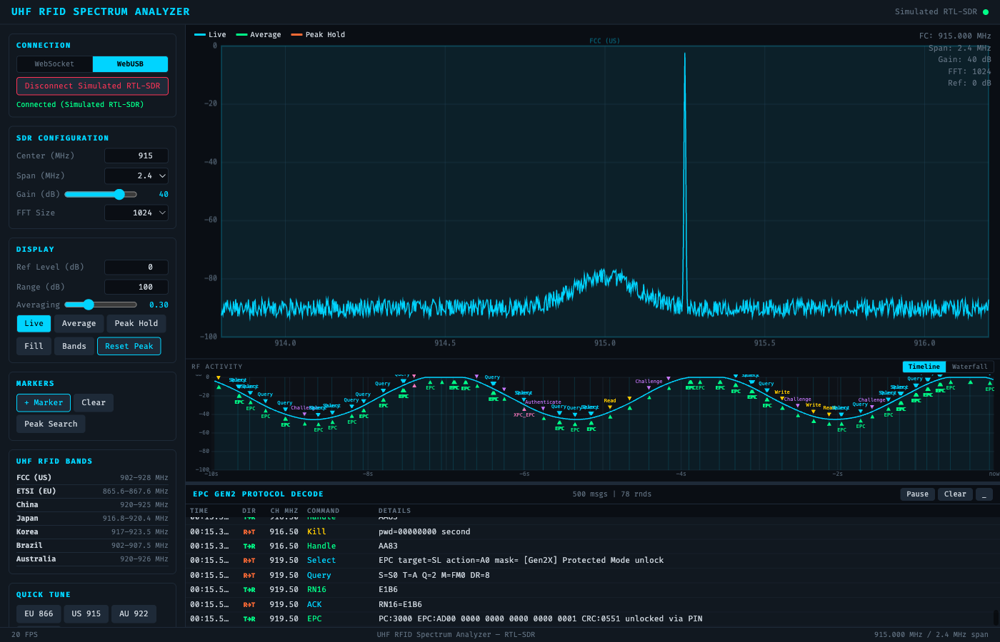
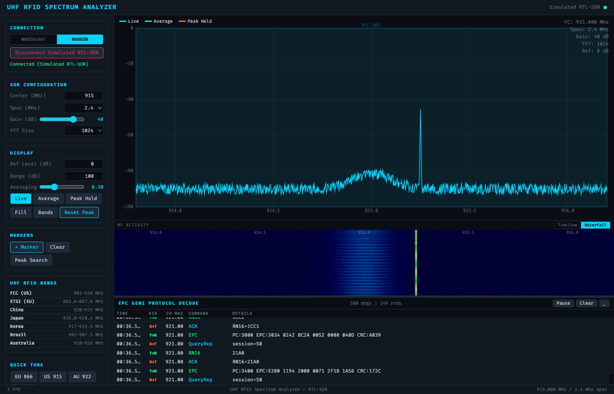

# UHF RFID Spectrum Analyzer

Real-time spectrum analyzer for UHF RFID bands (860–960 MHz) using an RTL-SDR dongle. Supports two connection modes:

- **WebSocket mode** — Python backend controls the RTL-SDR; data streamed to browser via WebSocket
- **WebUSB mode** — Browser talks directly to the RTL-SDR over USB (no backend needed, Chrome/Edge only)

## Features

- Real-time spectrum display with configurable FFT size (256–4096)
- Waterfall / spectrogram view
- RSSI timeline with decode message markers
- **Real-time EPC Gen2 reader command decode** via PIE demodulation (WebUSB mode)
- EPC Gen2 / Gen2v2 / Gen2X protocol decode panel with round tracking
- UHF RFID band overlays for FCC, ETSI, China, Japan, Korea, Brazil, Australia
- Live, average (EMA), and peak-hold traces
- Frequency markers with peak search
- Quick-tune presets for regional RFID bands
- Adjustable center frequency, span, gain, reference level, and dynamic range
- Simulation mode with full protocol decode demo (no hardware needed)

## Screenshots

### Spectrum + RSSI Timeline with Protocol Decode



Real-time spectrum display (top), RSSI timeline with decoded command markers (middle), and EPC Gen2 protocol decode table (bottom). Shows inventory rounds, access commands, Gen2v2 security operations, and Gen2X extensions.

### Waterfall View with Protocol Decode



Waterfall/spectrogram view showing signal energy over time, with the protocol decode panel displaying Reader→Tag and Tag→Reader message sequences including EPC reads, memory access, and authentication.

## Requirements

### WebSocket mode (Python backend)

```
Python 3.8+
pip install -r requirements.txt
```

Hardware: RTL-SDR dongle (RTL2832U-based)

System: `librtlsdr` must be installed:
- Debian/Ubuntu: `sudo apt install librtlsdr-dev`
- macOS: `brew install librtlsdr`
- Windows: Zadig driver + librtlsdr DLLs

### WebUSB mode (browser-only)

- Chrome, Edge, or Opera (WebUSB support required)
- HTTPS or localhost
- Linux: udev rule for RTL-SDR USB access (or run browser as root for testing)

## Usage

### Option 1: WebSocket mode (Python backend)

```bash
# Start with real hardware
python server.py

# Start in simulation mode (no RTL-SDR needed)
python server.py --simulate

# Custom settings
python server.py -f 915 -r 2.4 -g 40 -n 1024 --fps 20
```

Then open `http://localhost:8080` in your browser.

#### CLI options

| Flag | Description | Default |
|------|-------------|---------|
| `-f` | Center frequency (MHz) | 915 |
| `-r` | Sample rate / span (MHz) | 2.4 |
| `-g` | RF gain (dB) | 40 |
| `-n` | FFT size | 1024 |
| `-d` | RTL-SDR device index | 0 |
| `--ws-port` | WebSocket port | 8765 |
| `--http-port` | HTTP port | 8080 |
| `--fps` | Target frame rate | 20 |
| `--simulate` | Simulated SDR data | off |

### Option 2: WebUSB mode (no backend)

Serve the files over HTTPS or localhost:

```bash
# Simple local server
python -m http.server 8080
```

Open `http://localhost:8080` in Chrome/Edge, click **WebUSB** in the sidebar, then **Connect RTL-SDR via USB**.

The browser will prompt you to select the RTL-SDR device. All signal processing (FFT, averaging, peak hold) and protocol decode runs client-side in JavaScript.

### Option 3: Demo mode (no hardware)

```bash
python -m http.server 8080
```

Open `http://localhost:8080?demo` — starts the simulated RTL-SDR with full protocol decode demo automatically.

## File Structure

```
rfid-spectrum-analyzer/
├── index.html           # Main UI (spectrum + waterfall + controls + decode panel)
├── webusb-rtlsdr.js     # WebUSB RTL-SDR driver + browser-side FFT
├── pie-decoder.js       # PIE demodulator + EPC Gen2 command parser (real-time decode)
├── server.py            # Python WebSocket backend
├── requirements.txt     # Python dependencies
├── screenshots/         # UI screenshots
└── README.md
```

## Protocol Reference

<details>
<summary>EPC Gen2 (ISO 18000-63) Command Reference</summary>

### PIE Encoding

Reader→Tag commands use **Pulse Interval Encoding (PIE)**. Each symbol is measured from falling edge to falling edge:

- **Data-0**: duration = Tari (6.25–25 μs)
- **Data-1**: duration = 1.5×Tari to 2×Tari
- **RTcal** (R→T calibration): Data-0 + Data-1 duration
- **Pivot**: RTcal / 2 (decision threshold: symbol < pivot → 0, ≥ pivot → 1)

### Preamble Structure

```
delimiter → Data-0 (Tari) → RTcal → [TRcal] → command bits
```

- **Delimiter**: ~12.5 μs low pulse (valid range: 8–19 μs)
- **Tari**: Reference interval established by first Data-0 symbol
- **RTcal**: Calibration symbol, must be > 2.5×Tari
- **TRcal**: Tag→Reader calibration (only in Query preamble)

### Command Table

| Prefix | Command | Bits | Description |
|--------|---------|------|-------------|
| `00` | QueryRep | 4 | Repeat query in current slot |
| `01` | ACK | 18 | Acknowledge tag RN16 |
| `1000` | Query | 22 | Start inventory round |
| `1001` | QueryAdjust | 9 | Adjust Q value |
| `1010` | Select | variable | Select tag population |
| `1011` | NAK | 8 | Negative acknowledge |

### Query Command Bit Layout (22 bits)

```
1000 | DR(1) | M(2) | TRext(1) | Sel(2) | Session(2) | Target(1) | Q(4) | CRC-5(5)
```

- **DR**: Divide ratio (0→8, 1→64/3)
- **M**: Modulation (00→FM0, 01→Miller2, 10→Miller4, 11→Miller8)
- **Session**: S0–S3
- **Target**: A or B
- **Q**: Slot count exponent (0–15, 2^Q slots)
- **CRC-5**: x^5 + x^3 + 1, preset 0x09

### Select Command

```
1010 | Target(3) | Action(3) | MemBank(2) | Pointer(EBV) | Length(8) | Mask(var) | Truncate(1) | CRC-16
```

- **MemBank**: 00→Reserved, 01→EPC, 10→TID, 11→User
- **Pointer**: Extensible Bit Vector (variable length)
- **CRC-16**: x^16 + x^12 + x^5 + 1, preset 0xFFFF

</details>

<details>
<summary>Gen2 Access Commands</summary>

All access commands use 8-bit prefix `11000xxx` + CRC-16.

| Prefix | Command | Key Fields |
|--------|---------|------------|
| `11000000` | Req_RN | RN16 |
| `11000001` | Read | MemBank, WordPtr (EBV), WordCount |
| `11000010` | Write | MemBank, WordPtr (EBV), Data (16-bit) |
| `11000011` | Kill | Password (16-bit per phase) |
| `11000100` | Lock | Payload (20-bit mask + action) |
| `11000101` | Access | Password (16-bit) |
| `11000110` | BlockWrite | MemBank, WordPtr, WordCount, Data |
| `11000111` | BlockErase | MemBank, WordPtr, WordCount |

### Memory Banks

| Bank | ID | Contents |
|------|----|----------|
| Reserved | 00 | Kill password, Access password |
| EPC | 01 | CRC-16, PC, EPC |
| TID | 10 | Tag manufacturer + model ID |
| User | 11 | User-defined data |

</details>

<details>
<summary>Gen2v2 Security Commands</summary>

Gen2v2 (ISO 18000-63 Amendment) adds cryptographic security commands.

| Prefix | Command | Description |
|--------|---------|-------------|
| `11010000` | Authenticate | Crypto authentication (TAM1/TAM2 modes) |
| `11010001` | AuthComm | Authenticated communication channel |
| `11010010` | SecureComm | Encrypted communication |
| `11010100` | TagPrivilege | Query/set tag privilege levels |

### Authenticate Command

Supports AES-128 crypto suite with two modes:
- **TAM1**: Tag authenticates to reader (challenge-response)
- **TAM2**: Tag authenticates + returns encrypted data (e.g., TID)

### Additional Gen2v2 Operations

- **Challenge**: Simplified authentication without full TAM
- **Untraceable**: Hide EPC/TID/User data, control read range
- **FileOpen**: Open a specific file on multi-file tags

</details>

<details>
<summary>Impinj Gen2X Extensions</summary>

Proprietary extensions by Impinj for enhanced RFID performance.

| Prefix | Command | Description |
|--------|---------|-------------|
| `11100000` | QueryX | Extended query with inline filtering + multi-bank reply |
| `11100001` | QueryY | Extended query with filter modes |

### Gen2X Features

- **FastID**: Returns TID alongside EPC in a single inventory round (Select on TID bank + Query)
- **TagFocus**: Ensures only new/unread tags respond (S1 session trick)
- **Protected Mode**: PIN-locked tag visibility
- **Integra**: On-chip diagnostic reads via TID bank extension
- **Authenticity**: Crypto authentication using standard Authenticate command
- **ReadVar**: Variable-length memory read (returns data until end of bank)

### XPC (Extended Protocol Control)

When XPC is enabled (PC bit 9 set), the tag backscatters additional words:
```
PC (16) | XPC_W1 (16) | [XPC_W2 (16)] | EPC | CRC-16
```

</details>

<details>
<summary>PIE Signal Processing Pipeline</summary>

### RTL-SDR to Decoded Commands

```
RTL-SDR IQ (2.4 MSPS, 8-bit) → Float32 conversion
  → Envelope detection (|I + jQ|)
  → Single-pole IIR lowpass (~100 kHz cutoff)
  → Adaptive threshold (EMA of high/low levels, midpoint)
  → Binary conversion (above/below threshold)
  → Edge detection (rising/falling)
  → PIE state machine (delimiter → Tari → RTcal → bits)
  → Gen2 command parser (prefix matching + field extraction)
  → CRC validation (CRC-5 for Query, CRC-16 for others)
  → Message emission with round tracking
```

### PIE State Machine

```
IDLE ──────────► WAIT_DELIMITER ──────────► WAIT_DATA0
  ▲  falling edge    │  valid delimiter        │
  │                  │  (8–19 μs low pulse)    │
  │                  ▼                         ▼
  │              [invalid]              WAIT_RTCAL
  │                                        │
  │                          ┌─────────────┤
  │                          │ Tari valid   │ RTcal valid
  │                          ▼              ▼
  │                    measure Tari → DECODING_BITS
  │                                        │
  │              CW gap > 3×RTcal          │
  ◄────────────── PARSE_COMMAND ◄──────────┘
```

### Timing Parameters

| Parameter | Typical | Range | Description |
|-----------|---------|-------|-------------|
| Tari | 12.5 μs | 6.25–25 μs | Data-0 symbol duration |
| RTcal | 31.25 μs | 2.5×Tari – 3×Tari | R→T calibration |
| Delimiter | 12.5 μs | 8–19 μs | Preamble start marker |
| Pivot | RTcal/2 | — | Bit decision threshold |
| CW timeout | 3×RTcal | — | End-of-command detection |

### Sample Capture Strategy

When decode is active, the RTL-SDR reads 32768 samples per frame (13.6 ms at 2.4 MSPS) instead of the standard 1024 (0.4 ms). The FFT uses a subarray of the first 1024 samples, while the full buffer feeds the PIE decoder. This provides ~27% RF capture duty cycle at 20 FPS.

</details>
